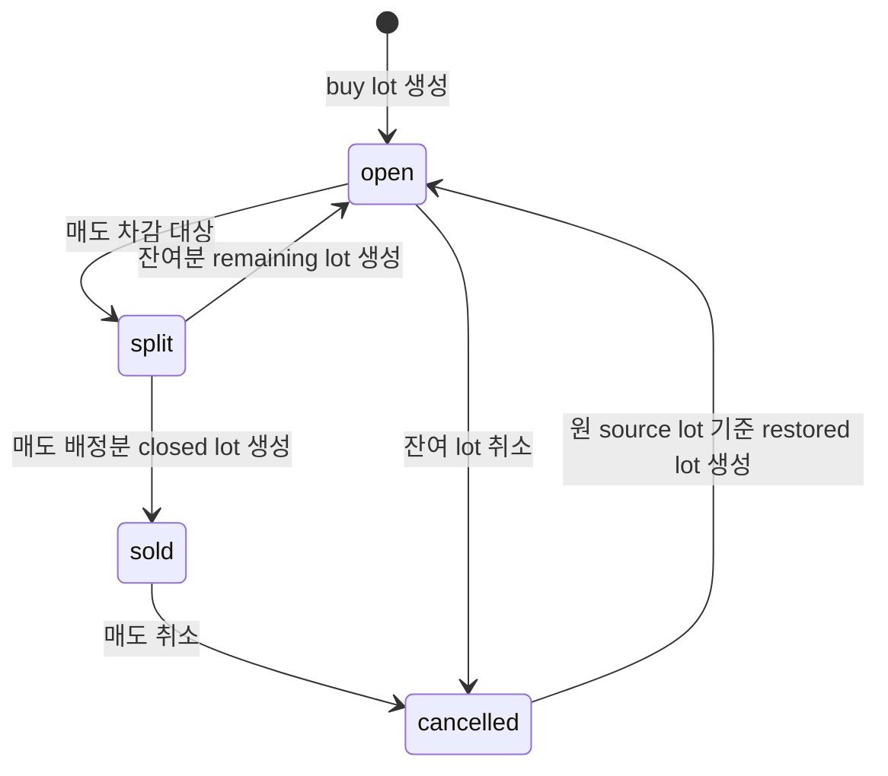
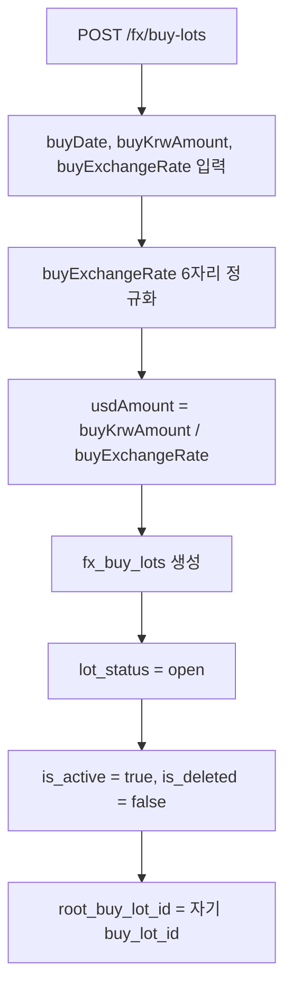
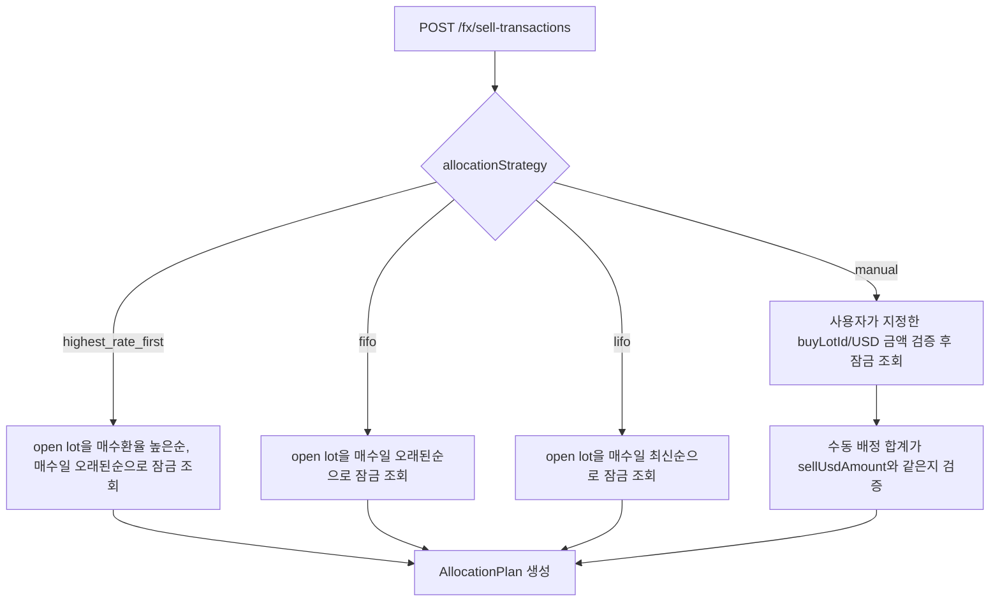
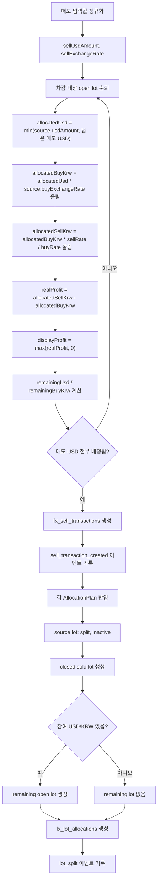
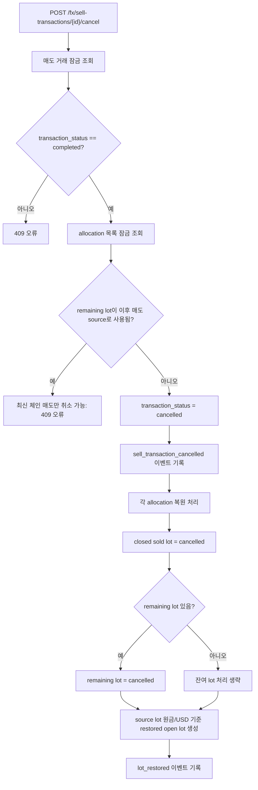
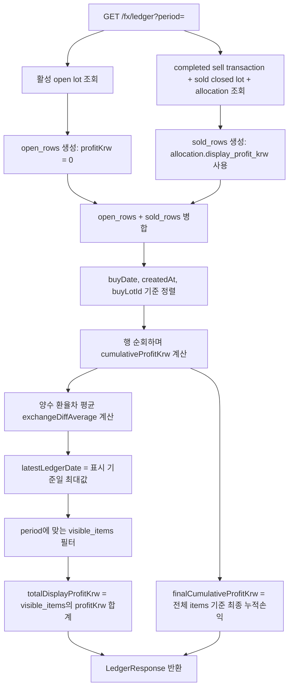
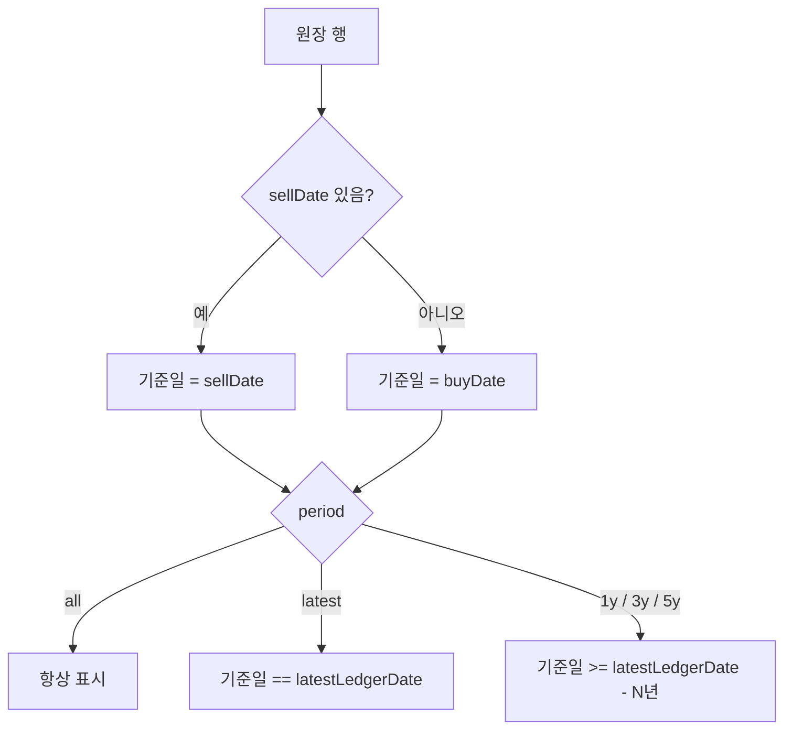
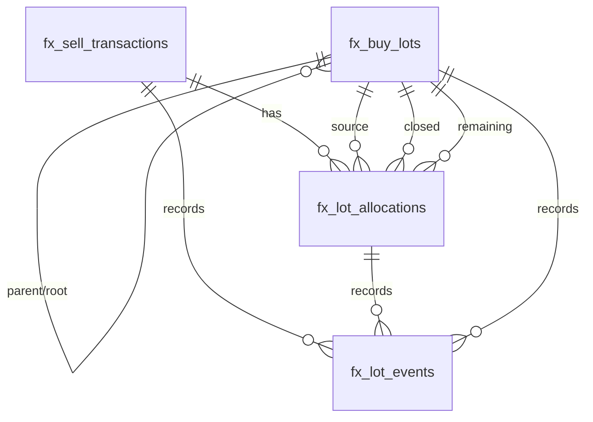

# FX Core Logic Flow

이 문서는 DW FX Ledger의 FX 핵심 비즈니스 로직 흐름을 순서도로 정리한다.
기준 구현은 `apps/api/app/services/fx.py`이며, DB 스키마는 변경하지 않는다.

## 핵심 상태

| 상태 | 의미 |
| --- | --- |
| `open` | 매도에 사용할 수 있는 활성 매수 로트 |
| `split` | 매도 배정으로 닫힌 원본/source 로트 |
| `sold` | 매도된 배정분 closed 로트 |
| `cancelled` | 삭제 또는 매도 취소로 비활성화된 로트 |

## 매수 로트 생성

## 매도 차감 전략 선택

## 매도 로트 분할 및 배정

## 매도 취소 및 로트 복원

## FX 원장 조회

## 원장 기간 필터 기준

## 수익 계산 기준

| 항목 | 계산 기준 |
| --- | --- |
| `realProfitKrw` | 실제 배정 매도원화 - 배정 매수원화 |
| `displayProfitKrw` | `max(realProfitKrw, 0)` |
| `totalRealProfitKrw` | 완료된 전체 매도 거래의 실제 손익 합계 |
| `totalDisplayProfitKrw` | 현재 기간 필터에 표시된 원장 행의 표시손익 합계 |
| `finalCumulativeProfitKrw` | 기간 필터와 무관한 전체 원장 기준 최종 누적손익 |
| `exchangeDiff` | `max(sellExchangeRate - buyExchangeRate, 0)` |
| `exchangeDiffAverage` | 원장 정렬 순서상 양수 환율차의 누적 평균 |

## 주요 테이블 관계

